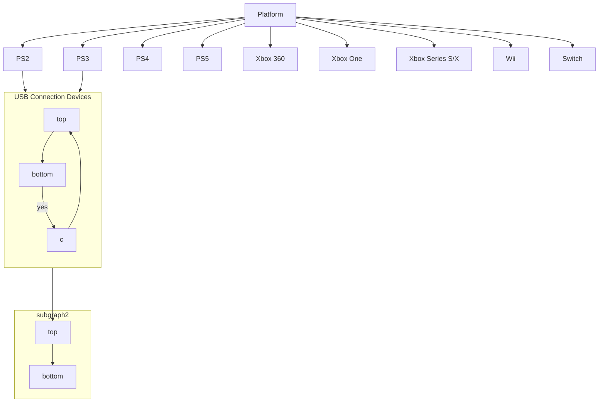

```mermaid placement="top-right"
  flowchart TB
    subgraph USB[USB Connection Devices]
        direction TB
        top1[top] --> bottom1[bottom]
		bottom1 -- yes --> call[c]
		call[c] --> top1
    end
    subgraph subgraph2
        direction TB
        top2[top] --> bottom2[bottom]
   	end
    %% ^ These subgraphs are identical, except for the links to them:

    %% Link *to* subgraph1: subgraph1 direction is maintained
	Platform --> PS2
	Platform --> PS3
	Platform --> PS4
	Platform --> PS5
	Platform --> XB360[Xbox 360]
	Platform --> XB1[Xbox One]
	Platform --> XBS[Xbox Series S/X]
	Platform --> Wii
	Platform --> Switch
	
    PS2 --> USB
	PS3 --> USB
    %% Link *within* subgraph2:
    %% subgraph2 inherits the direction of the top-level graph (LR)
     ---> top2
```